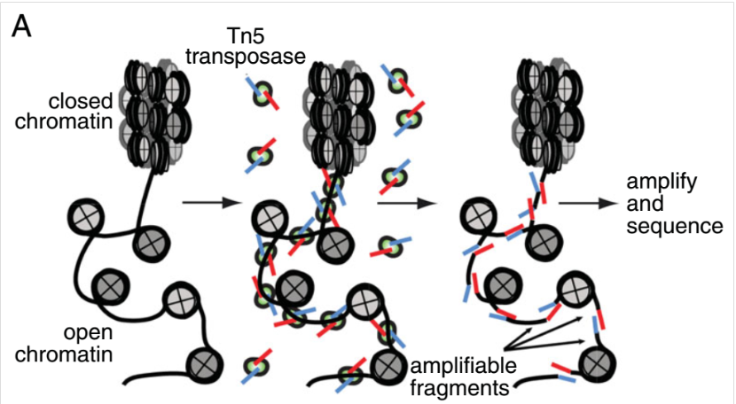
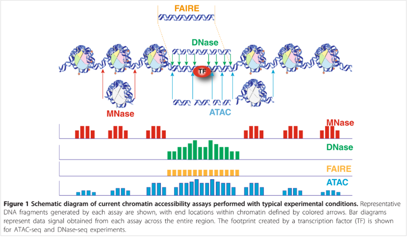

```{r setup, include=FALSE}
knitr::opts_chunk$set(echo = TRUE, message = F, warning = F)
```

[From this website: ](https://yiweiniu.github.io/blog/2019/03/ATAC-seq-data-analysis-from-FASTQ-to-peaks/)


## ATAC-seq overview  
ATAC-seq (Assay for Transposase-Accessible Chromatin with high-throughput sequencing) is a method for determining chromatin accessibility across the genome. It utilizes a hyperactive Tn5 transposase to insert sequencing adapters into open chromatin regions.  

ATAC-seq overview 


Comparing chromatin accessibility assays  


ATAC-seq can be used to  
    - generate epigenomic profiles  
    - map accessible chromatin across tissues or conditions  
    - retrieve nucleosome positions  
    - identify important transcription factors  
    - generate occupancy of TFs (footprinting)  
    
    
## Experimental design  
    - two or more biological replicates  
    - each replicate has 25 million non-duplicate, non-mitochondrial aligned reads for single-end sequencing and 50 million for paired-ended sequencing  
    - typically, no need for input  
    - use as few PCR cycles as possible when constructing the libarry  
    - paired-end sequencing is prefered  
    


