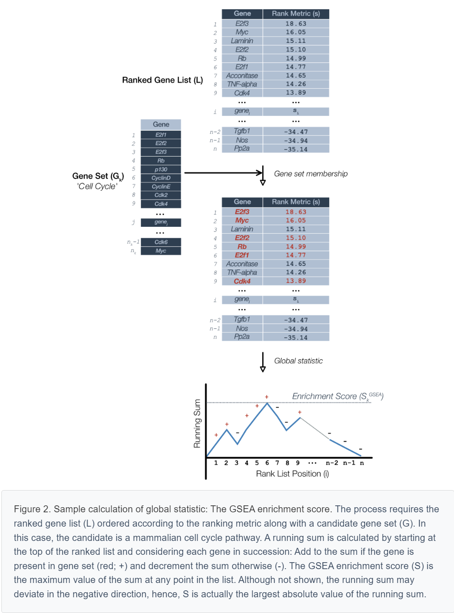

```{r setup, include=FALSE}
knitr::opts_chunk$set(echo = TRUE)
```


<script type="text/x-mathjax-config">
MathJax.Hub.Config({
TeX: {
equationNumbers: {
autoNumber: "all",
formatNumber: function (n) {return +n}
}
}});</script>


[From this site](https://www.pathwaycommons.org/guide/primers/data_analysis/gsea/)


# Background
High-throughput approaches for gene expression measurement can generate a tremendous volume of data but can be unwieldy and easily outstrip intuition. The noisy nature of biological processes compounds the difficulty in interpreting outputs of large-scale experiments. Clearly, there is a need for robust approaches that place data in a wider context that is more biologically meaningful to the scientific question at hand.  

To this end, approaches collectively termed ‘Over-representation Analyses’ (ORA) were developed to take large lists of genes emerging from experimental results and determine whether there was evidence of enrichment for gene sets grouped on the basis of some shared theme (Khatri 2005, Khatri 2012). In simple terms, ORA approaches aim to distill which pathways are present within a list of genes. A popular source of sets is the Gene Ontology (GO) which groups of genes according to various biological processes and molecular functions.

## The 'SAFE' framework
While tremendously useful for interpreting differential expression output, ORA approaches have three major limitations. First, the inclusion criteria for input gene lists are rather arbitrary and typically involves selecting genes that exceed some user-defined statistical cutoff. This risks excluding potentially important genes that for whatever reason fail to reach statistical significance. Second, ORA approaches use gene names but not any of the rich quantitative information associated with gene expression experiments. In this way, equal importance is assigned to each an every gene. **Third, many of the ORA procedures uses statistical procedures that assume independence among genes: Changes in any gene do not affect or are not influenced by any others**. Clearly, this is unrealistic for biological systems and has the effect of making ORA procedures more prone to erroneous discoveries or false-positives.  

Gene Set Enrichment Analysis (GSEA) is a tool that belongs to a class of second-generation pathway analysis approaches referred to as *significance analysis of function and expression (SAFE)* (Barry 2005). These methods are distinguished from their forerunners in that they make use of entire data sets including quantitive data gene expression values or their proxies.  

Methods that fall under the SAFE framework use a four-step approch to map gene list onto pathways:  
1. Calculate a local (gene-level) statistic  
    + signal noise ratio: the difference in means of the two classes divided by the sum of the standard deviations of the two diagnostic classes.  
    
2. Calculate a global (gene set or pathway-level) statistic  
3. Determine significance of the global statistic  
4. Adjust for multiple testing  

## Origins of GSEA
GSEA was first described by Mootha et al. (Mootha 2003) in an attempt to shed light on the mechanistic basis of Type 2 diabetes mellitus. They reasoned that alterations in gene expression associated with a disease can manifest at the level of biological pathways or co-regulated gene sets, rather than individual genes. The lack of power to detect true signals at the gene level may be a consequence of high-throughput expression measurements which involve heterogeneous samples, modest sample sizes and subtle but nevertheless meaningful alterations expression levels. Ultimately these confound attempts to derive reproducible associations with a biological state of interest.  

In their study, Mootha et al. employed microarrays to compare gene expression in mice with diabetes mellitus (DM2) to controls with normal glucose tolerance (NGT). On one hand, two statistical analysis approaches failed to identify a single differentially expressed gene between these two groups of mice. On the other hand, GSEA identified oxidative phosphorylation (OXPHOS) as the top scoring gene set down-regulated in DM2; The next four top-scoring gene sets largely overlapped with OXPHOS.  

Importantly, the prominence of OXPHOS genes provided the necessary clues for the authors to hypothesize that peroxisome proliferator-activated receptor $\beta$ coactivator $1\alpha$ ($PGC-1\alpha$ encoded by PPARGC1) might play a role in DM2. Indeed, follow-up experiments demonstrated that PPARGC1 expression was lower in DM2 and over-expression in mouse skeletal cells was sufficient to increase OXPHOS expression. Buoyed by the success of GSEA in this case, the authors went on to suggest the particular niche that the approach might occupy.  

> Single-gene methods are powerful only when the individual gene effect is marked and the variance is small across individuals, which may not be the case in many disease states. Methods like GSEA are complementary to single-gene approaches and provide a framework with which to examine changes operating at a higher level of biological organization. This may be needed if common, complex disorders typically result from modest variation in the expression or activity of multiple members of a pathway. As gene sets are systematically assembled using functional and genomic approaches, methods such as GSEA will be valuable in detecting coordinated variation in gene function that contributes to common human diseases.  

Criticisms concerning the original methodology (Damian 2004) were considered in an updated version of GSEA described in detail by Subramanian et al. (Subramanian 2005). Below, we provide a description of the approach with particular emphasis on the protocol we recommend for analyzing gene lists ranked according to differential expression.

# Significance Analysis of Function and Expression
## SAFE Step 1. Local statistic
In this step, we describe a local or gene-level measure that is used to rank genes, in GSEA terminology, a ‘rank metric’. Previously, we described how to obtain and process RNA-seq datasets into a single list of genes ordered according to a function of each gene’s p-value calculated as part of differential expression testing. In this context, a p-value assigned to a gene can be interpreted as the probability of a difference in gene expression between groups at least as extreme as that observed given no inter-group difference. We simply declare this function of p-values the rank metric.  

```{r local-statistic, out.width='80%'}
knitr::include_graphics("figures/Local-statistic.png")
```


An example of a rank metric is the product of the sign of the 'direction' in the expression change (up-regulation is positive and down-regulation is negative) and the p-value (P).  

$$s_{i} = s(P_{i}) = sign(flod\hspace{0.2cm}change\hspace{0.2cm}gene\hspace{0.2cm}i)\cdot -log_{10}(P_{i})$$

Under this rank metric, up-regulated genes with relatively small p-values appear at the top of the list and down-regulated genes with small p-values at the bottom.  

## SAFE Step 2. Global statistic
The global statistic is at the very heart of GSEA and the rather simple algorithm used to calculate it belies a rather profound statistical method to judge each candidate gene set. We will set aside the technical details for a moment to see how GSEA calculates the enrichment score for a given pathway.  

Let's pick up the process following Figure \@ref(fig:local-statistic) where we have a list of ranked genes. For illustrative purposes, suppose we wish to test the list for enrichment of a cell cycle pathway (Figure \@ref(fig:global-statistic)).

```{r global-statistic, out.width='80%'}

```

> Figure 2. Sample calculation of global statistic: The GSEA enrichment score. The process requires the ranked gene list (L) ordered according to the ranking metric along with a candidate gene set (G). In this case, the candidate is a mammalian cell cycle pathway. A running sum is calculated by starting at the top of the ranked list and considering each gene in succession: Add to the sum if the gene is present in gene set (red; +) and decrement the sum otherwise (-). The GSEA enrichment score (S) is the maximum value of the sum at any point in the list. Although not shown, the running sum may deviate in the negative direction, hence, S is actually the largest absolute value of the running sum.  

GSEA considers candidate gene sets one at a time. To calculate the enrichment score, GSEA starts at the top of the ranked gene list. If a gene is a member of the candidate gene set then it adds to a running sum, otherwise, it subtracts. This process is repeated for each gene in the ranked list and the enrichment score for that gene set is equal to the largest absolute value that the running sum achieved.  

One aspect of this algorithm we side-stepped is the value that gets added or subtracted. In the original version of GSEA (Mootha 2003) the values were chosen specifically such that the sum over all genes would be zero. In Figure 2, this would be equivalent to the running sum meeting the horizontal axis at the end of the list. In this case, the enrichment score is the Kolmogorov-Smirnov (K-S) statistic that is used to determines if the enrichment score is statistically significant. The updated procedure described by Subramanian et al (Subramanian 2005) uses a ‘weighted’ version of the procedure whereby the increments to the running sum are proportional to the rank metric for that gene. The reasons for these choices are rather technical and we reserve this for those more mathematically inclined in the following section.  

### The enrichment score
Consider a single gene set $G_{k}$ indexed by $k$. The gene set consists of a list of $n_{k}$ genes $g_{kj}$, that is $G_{k} = \{g_{kj}: j = 1, ..., n_{k}\}$. Note that each gene in the set must be a represented in the ranked list $L$ as you will see shortly.  

Define the set of genes outside of the set as $\overline{G} = \{\overline{g}_{kj}: 1, ..., n-n_{k}\}$. We summarize the relevant notation up to this point.  

- Notation  
        + Number of genes: n  
        + Gene rank metric: s  
        + Gene set: $G_{k}$ where $k = 1, ..., K$  
        + Genes in gene set: $G_{k} = \{g_{kj}: j = 1, ..., n_{k}\}$  
        + Genes not in gene set: $\overline{G}_{k} = \{\overline{g}_{kj}: j = 1, ..., n-n_{k}\}$  
        
        
Define the enrichment score for a given gene set as $S_{k}^{GSEA}$ which is the (weighted) Kolmogorov-Simirnov (K-S) statistic.  

$$
S_{k}^{GSEA} = \sup\limits_{1 \leq i \leq n}(F_{i}^{G_{k}} - F_{i}^{\overline{G}_{k}})
$$ 

Where $sup$ is the supremum and the indeces $i$ represents the position or rank in $L$. The $S_{k}^{GSEA}$ is the largest difference in $F$ which are the (weighted) empirical cumulative distribution functions.  

$$
F_{i}^{G_{k}} = \frac{\sum_{t=1}^{i}|S_{t}|^{\alpha}\cdot\Gamma_{\{gene_{t}\subset G_{k}\}}}{\sum_{t=1}^{n}|S_{t}|^{\alpha}\cdot\Gamma_{\{gene_{t}\subset G_{k}\}}}
$$

$$
F_{i}^{\overline{G}_{k}} = \frac{\sum_{t=1}^{i}\Gamma_{\{gene_{t}\subset \overline{G}_{k}\}}}{n - n_{k}}
$$

where $\Gamma$ is the indicator function for membership in the specified gene set. We will note here that the enrichment score is function of the the gene set size, which will come into play when we discuss significance testing below. To get a better feel for what these equations mean, lets see what happens when we vary the exponent $\alpha$.  

### Equal weights: The 'classic' Kolmogorov-Smirnov statistic
Consider the simple case when $\alpha=0$. Then all contributions from genes in the gene set do not take into account the rank metric $s$ in (3). In effect, this gives all genes equal weight.

$$
F_{i}^{G_{k}} = \frac{1}{n_{k}}\sum_{t=1}^{i}\Gamma_{\{gene_{t}\subset G_{k}\}}
$$

Under these circumstances, the $S_{k}^{GSEA}$ calculated using (5) is the 'classic' version of the Kolmogorov-Smirnov (K-S) statistic. It is more common to represent $F$ as an empirical cumulative distribution function (ecdf) of an order statistic ($X_{(\cdot)}$). Without loss of generality, define the order statistic as the rank or index of each gene in $L$ that is, $X_{(1)} = 1, X_{(2)} = 2, ..., X_{(i)} = i, ..., X_{(n)} = n$. For ease of notation, we drop the subscript brackets.  

Using the order statistic notation, equation (5) describing the contribution of genes within the gene set can be expressed as  

$$
\hat{F}_{n}^{G_{k}} = \frac{1}{n_{k}}\sum_{t=1}^{n}\Gamma_{\{X_{t}\leq x\} \cdot \Gamma_{\{gene_{t}\subset G_{k}\}}}
$$

In the same way, we can express equation (4) for the genes outside the gene set as  

$$
\hat{F}_{n}^{\overline{G}_{k}}(x) = \frac{1}{n-n_{k}}\sum_{t=1}^{n}\Gamma_{\{X_{t} \leq x\} \cdot \Gamma_{\{gene_{t} \subset \overline{G}_{k}\}}}
$$

Rather than plotting a single running sum (Figure \@ref(fig:global-statistic)) we can plot its constitutent $\hat{F}_{n}^{G_{k}}(x)$ and $\hat{F}_{n}^{\overline{G}_{k}}(x)$ on the same axes, such as in Figure \@ref(fig:ecdf)

```{r ecdf, out.width='80%'}
knitr::include_graphics("figures/cedf.png")
```

> Figure 3. Empirical cumulative distribution functions. (Above) A hypothetical ordered gene list where each line represents a gene in the gene set (red) or not (blue). (Below) Empirical cumulative distribution functions for the genes in the gene set (red) and those outside the gene set (blue). The maximum deviation ecdfs is the dotted green line.  

Upon close inspection, it is simple to relate the running sum (bottom Figure 2) with the ecdfs (Figure \@ref(fig:ecdf)): Increases in the running sum correspond to increments in the ecdf of genes within the gene set (Figure \@ref(fig:ecdf), red) and likewise, decreases in the running sum correspond to increments in the ecdf for genes outside (blue). Then, the enrichment score - the largest deviation in the running sum - corresponds to the largest vertical distance between ecdf plots (dotted green).  

We are now ready to handle the most important question that gets to the very validity of GSEA: When is the $S_{k}^{GSEA}$ 'significant'?.  

### The Kolmogorov-Smirnov goodness-of-fit test
We have learn that the $S^{GSEA}$ can be represented as the biggest distance between component ecdfs. To ask whether a given $S^{GSEA}$ is significant is equivalent asking whether the component ecdfs represent different 'samples' of the same cdf and whether their differences are attributable to minor sampling errors. For didactic purpose, we'll first present a simpler case, where we set up a K-S goodness-of-fit test between a single empirical cdf derived from a sample and a theoretical 'specified' cdf. We will also define concepts mentioned already in a more rigorous fashion.  

### One sample K-S goodness-of-fit test 
Suppose we have an independent and identically distributed sample $X_{1}, ..., X_{n}$ with some unknown cdf $P$ and we wish to test whether it is equal to a specified cdf $P_{0}$. The null hypothesis is   

$$
H_{0}: P = P_{0}
$$

Concretely, define the empirical cumulative distribution function (ecdf) that is generated from the data.  

$$
\hat{F_{n}}(x) = \sum_{t=1}^{n}\Gamma_{\{X_{t} \leq x\}}
$$

Then the K-S goodness-of-fit test proceeds by assuming that the ecdf in equation (9) is estimate of a specific cdf $F(x)$.  

Definition The Kolmogorov-Smirnov statistic $D_{n}$ is the distance between two functions.  

$$
D_{n} = \sup\limits_{x}|\hat{F_{n}}(x) - F(x)|
$$

So given the null hypothesis that the ecdf is a sample from the specified cdf, we want to known how the $D_{n}$ behaves. In other words, if we calculate a value of $D_{n}$ then we wish to known if it is a discrepancy that is worthy of further investigation. It turns out that there is an analytic solution to this question, that is, there is an equation for the probability distribution of $D_{n}$ so that we can derive a p-value under our null hypothesis. To get to this point, we'll need a few theorems, which we present without proof.  

**Theorem 1** The **Glivenko-Cantelli** theorem:  

$$
D_{n} \rightarrow 0 \hspace{0.3cm} as \hspace{0.3cm} n \rightarrow \infty
$$

The significance of this theorem is subtle: The sample points we use to construct our ecdf along with all those points in between are sure to be within a specified distance of the target cdf when $n \gt N$. This is also termed 'uniform convergence'.  

**Theorem 2** The **distribution-free property** states that the distribution of $D_{n}$ is the same for all continuous underlying distribution function $F$.  

The distribution-free property is a key aspect of the K-S test and pretty powerful result. It says that regardless of whether the $F$ is normal, uniform, gamma or even some completely unknown distribution, they all have the same $D_{n}$ distribution. This is particularly useful because we won’t have any idea what the distribution of the ecdfs used to construct our GSEA running sum will be.  

The Glivenko-Cantelli and the distribution-free properties are nice, but not very useful in practice. Knowing that an ecdf will converge regardless of the form of the distribution is just the start. What we really want to know is how the convergence happens, that is, how $D_{n}$ is distributed. This leads us right into the next theorem.  

**Theorem 3** Define $K(x)$ as the Kolmogorov-Smirnov distribution then,  

$$
P(\sqrt{n}D_{n} \le x) \rightarrow K(x) = \sum_{k=- \infty}^{\infty}(-1)^{k}exp(-2k^{2}x^{2})
$$

Theorem 3 is the culmination of an extensive body of knowledge surrounding empirical process theory that, in simple terms, describes the distribution of random walks between two fixed endpoints and bounds (i.e. the interval $[0,1]$ as these are the cdf bounds) otherwise known as a ‘Brownian Bridge’.  

The practical outcome of these theorems is that it gives us an equation from which we can calculate the exact probability of our maximum ecdf deviation from a specified cdf. In the K-S hypothesis testing framework, we set an a priori significance level $\alpha$ and calculate the probability of our observed $D_{n}$ or anything more extreme, denoting this the p-value $P$. If $P < \alpha$ then this would suggest a discrepancy between the data and the specified cdf causing us to doubt the validity of $H_{0}$.  

Recall that by definition, the enrichment score for any given candidate gene set depends upon its size. In this case, the scores are not identically distributed and must be normalized prior to calculating the p-values. We reserve this discussion for the next section we when broach the topic of null distributions.  

### Two sample K-S goodness-of-fit test
We are now ready to describe the setup that occurs in GSEA where we compare ecdfs representing the distribution of genes within and outside the gene set. Suppose we have a sample $X_{1}, ..., X_{\alpha}$ with cdf $F^{G_{k}}(x)$ and a second sample $Y_{1}, ..., Y_{\beta}$ with cdf $F^{\overline{G_{k}}}(x)$. GSEA is effectively a test of the null hypothesis  

$$
H_{0}: F^{G_{k}} = F^{\overline{G}_{k}}
$$

The corresponding ecdfs are $\hat{F}^{G_{k}}_{\alpha}$ and $\overline{F}_{\beta}^{\hat{G}_{k}}$ as before and the K-S statistic is  

$$
D_{ab} = (\frac{ab}{a + b})^{\frac{1}{2}}\sup\limits_{x}|\hat{F}_{\alpha}^{G_{k}} - \hat{F}_{\beta}^{\hat{G_{k}}}(x)|
$$

and the rest is the same.  

### Unequal weights: Boosting sensitivity
Consider the case when which is the recommended setting in GSEA. Then the global statistic is weighted by the value of the rank metric. Effectively, this renders the enrichment score more sensitive to genes at the top and bottom of the gene list compared to the classic K-S case.  

The choice to depart from the classic K-S statistic was two-flod. First, Subramanian et al. noticed an unwanted sensitivity of the enrichment score to genes in the middle of the list.  

> In the original implementation, the running sum statistic used equal weights at every stop, which yielded high scores for the sets clustered near the middle of the ranked list. These sets do not represent biologically relevent correlation with the phenotype.  

Second, the authors were unsatisfied with the observation that the unweighted method failed to identify well-known gene expression responses, in particular, the p53 transcriptional program in wild-type cells.  

> In the examples described in the text, and in many other examples not reported, we found that p = 1 (weighting by the correlation) is a very reasonable choice that allows significant genes with less than perfect coherence, i.e. only a subset of genes in the set are coordinately expressed, to score well.  

While weighting the enrichment score calculation with the rank metric can increase the power of the approach to detect valid gene sets, it does have several consequences that must be kept in mind.  

Recall that the enrichment score is a function of the size of the gene set . This means that enrichment scores must be normalized for gene set size. In the unweighted case, an analytic expression for the normalization factor can be estimate but when terms are weighted, this is no longer the case and once again, we defer to bootstrap measures to derive it.  

Another trade-off incurred by departing from the classic K-S statistic is that we no longer have an analytic expression for the null distribution of the enrichment scores. This motivates the empirical bootstrap procedure for deriving the null distribution discussed in the following section concerning significance testing.  

The above discussion motivates the next section on how GSEA generates null distributions for candidate gene set enrichment scores.  

## SAFE Step 3. Significance testing
To recap, GSEA uses the set of rank metrics for a gene list to calculate a set of enrichment scores for candidate gene sets. The primary issue at this point is which scores are indicative of enrichment? In hypothesis testing jargon, we wish to determine the statistical significance of each global statistic. We accomplish this by deriving a p-value representing the probability of observing a given enrichment score or anything more extreme. To do this, we require some understanding of how statistics are distributed.  

### Null distributions
From our discussion of the global statistic, using a weighted enrichment score leaves us without an analytic description of their null distribution. That is, weighting the enrichment score with the local statistic deviates from the classic Kolmogorov-Smirnov statistic which would typically follow a K-S-like distribution.  

GSEA employs ‘resampling’ or ‘bootstrap’ methods to derive an empirical sample of the null distribution for the enrichment scores of each gene set. The GSEA software provides a choice of two flavours of permutation methods that underlie the null distribution calculations.  

```{r null-distribution, out.width='80%'}

```

> Figure 4. GSEA uses permutation methods to generate null distrubutions for each gene set. For the sake of brevity, we depict a schematic of permutation methods for a single gene set. In GSEA, this process is represented separately for each gene set. A. Phenotype permutation. B. Gene set permutation. C. Calculation of p-values.  


### Phenotype permutation
The SAFE and GSEA publications describe ‘phenotype’ permutation approach to sample the null distribution (Figure \@ref(fig:null-distribution)).For a given gene set , this amounts to randomly swapping sample labels and recalculating a permutation enrichment score . This process is repeated times to generate which is a vector of points sufficient to depict the underlying distribution.  

From an intuitive standpoint, this generates a sample of the enrichment score distribution under the assumption of no particular association between gene rank and phenotype. In other words, we get a sense of how widely enrichment scores vary and how often when the two groups are effectively the same.  

From a statistical standpoint, the authors claim that this provides a more accurate description of the null model.  

> Importantly, the permutation of class labels preserves gene-gene correlations and, thus, provides a more biologically reasonable assessment of significance than would be obtained by permuting genes.  

Indeed, variations on GSEA that purport to simply the methodology rely on an assumption of gene-gene independence (Irizarry 2009). However, empirical comparisons suggest that ignoring these correlations leads to variance inflation - a wider and flatter null distribution - resulting in a much higher risk of false discovery for gene sets (Tamayo 2016).  

### Gene set permutation
The workflow we recommend uses as input a ‘pre-ranked’ list of genes are ordered by a function of the p-value for differential expression. In GSEA software this is called ‘GSEAPreranked’ and precludes phenotype permutation.  

Rather, a gene set permutation approach is used to generate the null distribution (Figure 4B). For each gene set of size , the same number genes are randomly selected from the ranked list and the corresponding enrichment score is calculated. This process is repeated times to generate the sample null distribution consisting of the vector .  

The GSEA team recommends using phenotype permutation whenever possible. This preserves the correlation structure between the genes in the dataset. Gene set permutation creates random gene sets and so disrupts the gene-gene correlations in the data. Thus, gene set permutation provides a relatively weaker (less stringent) assessment of significance.  

### P-value calculation
Once an empirical null distribution of values is in hand using either of the permutation methods described above, it is straightforward to calculate the p-value for an enrichment score. By definition, is the probability of observing a statistic or anything more extreme under the null hypothesis. In practice, we derive an empirical p-value by calculating the fraction of null values greater than or equal to our observed value .


## SAFE Step 4. Multiple testing correction
When we test a family of hypotheses, the chance of observing a statistic with a small p-value increases. When smaller than the significance level, they can be erroneously classified as discoveries or Type I errors. Multiple testing procedures attempt to quantify and control for these.  

In GSEA, the collection of gene sets interrogated against the observed data are a family of hypotheses. The recommended procedure for quantifying Type I errors is the false discovery rate (FDR). The FDR is defined as the expected value of the fraction of rejected null hypotheses that are in fact true. In practice, GSEA establishes this proportion empirically.  

In general, given a specified threshold of the global statistic, the FDR is the number of true null hypotheses larger than divided by the sum of true and false null hypotheses larger than . For GSEA, would be some value of the enrichment score and a true null hypothesis would represent a gene set that is in fact not enriched. In practice, we won’t directly observe the latter so it is estimated from the values of the empirical null that exceed.  

```{r test-correction, out.width='80%'}

```

> Figure 6. Empirical false discovery rate. A. The distribution of observed statistics and null distribution derived by permutation methods. T represents the threshold. B. Enlarged view of right-hand distribution tail in A. The number of null distribution values beyond the threshold is used to estimate the true null hypotheses. The fraction of erroneous rejections is estimated as the ratio of s_null (red) to s_obs (blue) and a correction is introduced when the number of data points are unequal.  

Suppose there are $n_{obs}$ observed and $n_{null}$ empirical null distribution data points. If the number of observed and null statistics beyond the threshold $T$ are $S_{obs}$ and $S_{null}$, respectively, then the empirical false discovery rate is  

$$
\hat{FDR} = \frac{\frac{S_{null}}{S_{obs}}}{\frac{n_{null}}{n_{obs}}}
$$

> For a nice primer on empirical methods for FDR estimation, we refer the reader to a well written piece by William S. Noble entitled ‘How does multiple testing correction work?’ (Noble 2009). 

<<<<<<< HEAD
https://www.pathwaycommons.org/guide/primers/data_analysis/gsea/#safe
=======
At first glance, this appears to be quite a straightforward exercise: We retrieve our sets of null distributions $S_{k,\pi(k)}^{GSEA}$ and observed enrichment statistics $S_{k}^{GSEA}$ and calculate the ratio for a given enrichment score threshold. However, there is one glaring problem: The enrichment statistic depends on gene set size which precludes comparison across gene sets.  

### Normalized enrichment score: Accounting for gene set size
That the enrichment score depends on gene set size can be seen from the definition in equations (2) - (4). Consequently, unless we are in an unlikely scenario where all the gene sets we test are of equal size, the enrichment scores will not be identically distributed and hence cannot be directly compared. This precludes the calculation of an empirical false discovery rate.  

GSEA solves this problem by applying a transformation to calculated enrichment scores such that they lie on a comparable scale. In particular, this normalized enrichment score (NES) is the enrichment score divided by the expected value (i.e. average) of the corresponding null distribution. Concretely, for each gene set we derive an enrichment score and a corresponding null distribution via gene set permutation.  

The normalized enrichment score $\zeta_{k}^{GSEA}$ is the score divided by the expected value of the corresponding null.  

$$
\zeta_{k}^{GSEA} = \frac{S_{k}^{GSEA}}{E[S_{k,\pi(k)}^{GSEA}]}
$$

In practice, we will partition the null into positive and negative values and use the average of these to normalize the positive and negative enrichment scores, respectively.  


Remember that, in addition to the gene set enrichment scores, we will also need a normalized null distribution for every gene set. Each element of a given null distribution will be determined in a similar fashion  


# USing RNA-seq datasets with GSEA
## Quantification Types and Input Data
GSEA requires as input an expression dataset, which contains expression profiles for multiple samples. While the software supports multiple input file formats for these datasets, the tab-delimited GCT format is the most common. The first column of the GCT file contains feature identifiers (gene ids or symbols in the case of data derived from RNA-Seq experiments). The second column contains a description of the feature; this column is ignored by GSEA and may be filled with “NA”s. Subsequent columns contain the expression values for each feature, with one sample's expression value per column. It is important to note that there are no hard and fast rules regarding how a GCT file's expression values are derived. The important point is that they are comparable to one another across features within a sample and comparable to one another across samples. RNA-seq quantification pipelines typically produce quantifications containing one or more of the following:  

- Counts/Expected Counts  
- TPM  
- FPKM/RPKM  

These quantifications are not properly normalized for comparisons across samples.  

> Note: ssGSEA (single-sample GSEA) projections perform substantially different mathematical operations from standard GSEA. For the ssGSEA implementation, gene-level summed TPM serves as an appropriate metric for analysis of RNA-seq quantifications.  

## Count normalization for Standard GSEA
Normalizing RNA-seq quantification to support comparisons of a feature's expression levels across samples is important for GSEA. Normalization methods (such as, TMM, geometric mean) which operate on raw counts data should be applied prior to running GSEA.

Tools such as DESeq2 can be made to produce properly normalized data (normalized counts) which are compatible with GSEA. The `DESeq2` module available through the GenePattern environment produces a GSEA compatible “normalized counts” table in the GCT format which can be directly used in the GSEA application.  

> Note: While GSEA can accept transcript-level quantification directly and sum these to gene-level, these quantifications are not typically properly normalized for between sample comparisons. As such, transcript level CHIP annotations are no longer provided by the GSEA-MSigDB team.  

The GSEA algorithm ranks the features listed in a GCT file. It provides a number of alternative statistics that can be used for feature ranking. But in all cases (or at least in the cases where the dataset represents expression profiles for differing categorical phenotypes) the ranking statistics capture some measure of genes' differential expression between a pair of categorical phenotypes. While these metrics are widely used for RNA-seq datasets, the GSEA team has yet to fully evaluate whether these ranking statistics, originally selected for their effectiveness when used with Microarray-based expression data, are entirely appropriate for use with data derived from RNA-seq experiments.  

## Alternative Method: GSEA-Preranked
This previously served as the GSEA team's recommended pipeline for analysis of RNA-seq data, however, we now recommend the normalized counts procedure described above. As an alternative to standard GSEA, analysis of data derived from RNA-seq experiments may also be conducted through the GSEA-Preranked tool.  

In particular:  
1. Prior to conducting gene set enrichment analysis, conduct your differential expression analysis using any of the tools developed by the bioinformatics community (e.g., cuffdiff, edgeR, DESeq, etc).  

2. Based on your differential expression analysis, rank your features and capture your ranking in an RNK-formatted file. The ranking metric can be whatever measure of differential expression you choose from the output of your selected DE tool. For example, cuffdiff provides the (base 2) log of the fold change.  

3. Run GSEAPreranked, if the exact magnitude of the rank metric is not directly biologically meaningful select "classic" for your enrichment score (thus, not weighting each gene's contribution to the enrichment score by the value of its ranking metric).  
>>>>>>> a1387082070441ad09de0e1a249a0cf039691fc1

Please note that if you choose to use any of the gene sets available from MSigDB in your analysis, you need to make sure that the features listed in your RNK file are genes, and the genes are identified by their HUGO gene symbols. All gene symbols listed in the RNK file must be unique, match the ENSEMBL version used in the targeted version of MSigDB, and we recommend the values of the ranking metrics be unique.  


# RNA-Seq Data and Ensembl CHIP files
A GSEA analysis requires three different types of input data: a gene expression dataset in GCT format, the corresponding sample annotations in CLS format, and a collection of gene sets in GMT format. GSEA is typically used with gene sets from the Molecular Signatures Database (MSigDB), which consist of HUGO human gene symbols. However, gene expression data files may use other types of identifiers, depending on how the data were produced. To proceed with the analysis, GSEA converts the identifiers found in the data file to match the human symbols used in the gene set files. The conversion is performed using a CHIP file that provides the mapping between the two types of identifiers. Over the years, we have been providing CHIP files for all major microarray platforms. For example, we have CHIP files that list the mappings between Affymetrix probe set IDs and human genome symbols.  

In RNA-Seq, gene expression is quantified by counting the number of sequencing reads that aligned to a genomic range, according to a reference genome assembly or transcript annotations. The majority of tools use Ensembl reference annotations for this purpose. To facilitate GSEA analysis of RNA-Seq data, we now also provide CHIP files to convert human and mouse Ensembl IDs to HUGO gene symbols. Ensembl annotation uses a system of stable IDs that have prefixes based on the species name plus the feature type, followed by a series of digits and a version, e.g., ENSG00000139618.1. The new GSEA Ensembl CHIP files provide mappings for human, mouse, and rat gene identifiers (i.e., Ensembl IDs with prefixes ENSG, ENSMUSG, ENSRNOG).  

To run GSEA with gene expression data specified with Ensembl identifiers:  
1. Prepare the GCT gene expression file such that identifiers are in the form of Ensembl IDs, but without the version suffix.  
2. For RNA-Seq data, you will need normalize and filter out low count measurements, and perform other preprocessing as needed. Consult your local bioinformatician for help unsure.  
3. Load the GCT and corresponding CLS files into GSEA.  
4. Choose gene sets to test - we usually recommend starting with the Hallmarks collection.  
5. Choose the CHIP file that matches the identifiers in the GCT file:  
    - Human_ENSEMBL_Gene_ID_MsigDB.vx.chip -> Ensembl ID prefix ENSG  
    - Mouse_ENSEMBL_Gene_ID_MSigDB.vx.chip -> Ensembl ID prefix ENSMUSG  
    - Rat_ENSEMBL_Gene_ID_MSigDB.vx.chip -> Ensembl ID prefix ENSRNOG  
    
We have also added the gene-level Ensembl IDs to the website for use with the Investigate Gene Sets tools such as Compute Overlaps. As noted above, it is necessary to remove the version suffix from any supplied IDs.  

**Note**: While GSEA can accept transcript-level quantification directly and sum these to gene-level, these quantifications are not typically properly normalized for between sample comparisons. As such, transcript level CHIP annotations are no longer provided by the GSEA-MSigDB team at this time.  


# References

https://www.pathwaycommons.org/guide/primers/data_analysis/gsea/#safe
https://www.gsea-msigdb.org/gsea/msigdb/download_file.jsp?filePath=/gsea/dataset_files/Gender.cls
https://www.gsea-msigdb.org/gsea/doc/GSEAUserGuideTEXT.htm#_Running_a_Leading