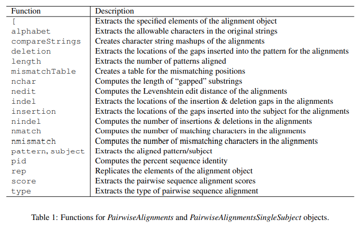

```{r setup, include=FALSE}
knitr::opts_chunk$set(echo = TRUE)
```

# Introduction

In this document we illustrate how to perform pairwise sequence alignments using the Biostrings package through the use of the pairwiseAlignment function. This function aligns a set of pattern strings to a subject string in a global, local, or overlap (ends-free) fashion with or without affine gaps using either a fixed or quality-based substitution scoring scheme. This function's computation time is proportional to the product of the two string lengths being aligned.

# Pairwise Sequence Alignment Problems

The global (Needleman-Wunsch), the local (Smith-Waterman), and overlap (ends-free) pairwise sequence alignment problems are described as follows.

Let string $S_{i}$ have $n_{i}$ characters $c_{i,j}$ with $j \subseteq \{1,2,...,n_{i}\}$. A pairwise sequence alignment is a mapping of strings $S_{1}$ and $S_{2}$ to gapped substrings $S'_{1}$ and $S'_{2}$ that are defined by

$$S'_{1} = g_{(1,a_{1})}c_{(1,a_{1})}...g_{(1,b_{1})}c_{(1,b_{1})}g_{(1,b_{1} + 1)}$$

$$S'_{2} = g_{(2,a_{2})}c_{(2,a_{2})}...g_{(2,b_{2})}c_{(2,b_{2})}g_{(2,b_{2} + 1)}$$

Where $a_{i}, b_{i} \subseteq \{1,2,...,n_{i}\}$ with $a_{i} \leq b_{i}$\
$g_{i,j} = 0$ or more gaps at the specified position $j$ for aligned string $i$\
$length(S'_{1}) = length(S'_{2})$

Each of these pairwise sequence alignment problems is solved by maximizing the alignment score. An alignment score is determined by the type of pairwise sequence alignment (global, local, overlap), which sets the [ai, bi] ranges for the substrings; the substitution scoring scheme, which sets the distance between aligned characters; and the gap penalties, which is divided into opening and extension components. The optimal pairwise sequence alignment is the pairwise sequence alignment with the largest score for the specified alignment type, substitution scoring scheme, and gap penalties. The pairwise sequence alignment types, substitution scoring schemes, and gap penalties influence alignment scores in the following manner:

-   Pairwise Sequence Alignment Types: The type of pairwise sequence alignment determines the substring ranges to apply the substitution scoring and gap penalty schemes. For the three primary (global, local, overlap) and two derivative (subject overlap, pattern overlap) pairwise sequence alignment types, the resulting substring ranges are as follows:

Global - $[a_{1},b_{1}] = [1, n_{1}]$ and $[a_{1}, b_{1}] = [1, n_{2}]$  
Local - $[a_{1}, b_{1}]$ and $[a_{2}, b_{2}]$  
Overlap - $\{[a_{1}, b_{1}] = [a_{1}, n_{1}], [a_{2}, b_{2}] = [1, b_{2}]\}$ or $\{[a_{1},b_{1}] = [1,b_{1}], [a_{2}, b_{2}] = [a_{2},n_{2}]\}$  
Subject Overlap - $[a_{1},b_{1}] = [1,n_{1}]$ and $[a_{2},b_{2}]$  
Pattern Overlap - $[a_{1}, b_{1}]$ and $[a_{2}, b_{2}] = [1,n_{2}]$  

- Substitution Scoring Schemes: The substitution scoring scheme sets the values for the aligned character pairings within the substring ranges determined by the type of pairwise sequenc alignment. This scoring scheme can be fixed for character pairings or quality-dependent for character pairings. (Characters that align with a gap are penalized according to the "gap penalty" framework.)  

- Fixed substitution scoring - Fixed substitution scoring schemes associate each aligned character pairing with a value. These schemes are very common and include awarding one value for a match and another for a mismatch, Point Accepted Mutation (PAM) matrices, and Block Substitution Matrix (BLOSUM) matrices.  

- Quality-based substitution scoring - Quality-based scoring schemes derive the value for the aligned character recording error. Let $\varepsilon_{i}$ be the probability of a character recording error. Assuming independence within and between recordings and a uniform background frequency of the different characters, the combined error probability of a mismatch when the underlying characters do match is $\varepsilon_{c} = \varepsilon_{1} + \varepsilon_{2} - (n/(n-1)) * \varepsilon_{1}*\varepsilon_{2}$, where n is number of characters in the underlying alphabet (e.g. in DNA and RNA, n = 4). Using $\varepsilon_{c}$, the substitution score is given by $b * log_{2}(\gamma_{(x,y)})*(1-\varepsilon_{c}) * n + (1-\gamma_{(x,y)}) * \varepsilon_{c}*(n/(n-1)))$, where b is the bit-scaling for the sci=oring and $\gamma_{(x,y))}$ is the probability that characters x and y represents the same underlying letters (e.g. using IUPAC, $\gamma_{(A,A)} = 1$ and $\gamma_{(A,N)} = 1/4$).

- Gap Penalties: Gap penalties are the values associated with the gaps within substring ranges determined by the type of pairwise sequence alignment. These penalties are divided into gap opening and gap extension components, where the gap opening penalty is the cost for adding a new gap and gap extension penalty is the incremental cost incurred along the length of the gap. A constant gap penalty occurs when there is a cost associated with opening a gap, but no cost for the length of a gap (i.e. gap extension is zero), but linear gap penalty occurs when there is no cost associated for opening a gap (i.e. gap opening is zero), but there is a cost for the length of the gap. An affine gap penalty occurs when both gap opening and gap extension have a non-zero associated cost.  

# Main Pairwise Sequence Alignment Function
The `pairwiseAlignment` function solves the pairwise sequence alignment problems mentioned above. It aligns one or more strings specified in the pattern argument with a single string specified in the subject argument.  

```{r}
library(Biostrings)

pairwiseAlignment(pattern = c("succeed", "precede"), 
                  subject = "supersede")
```

The type of pairwise sequence alignment is set by specifying the type argument to be one of 'global', 'local', 'overlap', 'global-local' and 'local-global'.  

```{r}
pairwiseAlignment(pattern = c("succeed", "preccede"), 
                  subject = "supersede", 
                  type = "local")
```

The gap penalties regulated by the `gapOpening` and `gapExtension` arguments.  

```{r}
pairwiseAlignment(pattern = c("succedd", "presede"), 
                  subject = "supersede", 
                  gapOpening = 0, 
                  gapExtension = 1)
```

The substitution scoring scheme is set using three arguments, two of which are quality-based related (patternQuality, subjectQuality) and one is fixed substitution related (substitutionMatrix). When the substitution scores are fixed by character pairing, the substitutionMatrix argument takes a matrix with appropriate alphabets as dimension names. The `nucleotideSubstitutionMatrix` function translates simple match and mismatch scores to the full spectrum of IUPAC nucleotide codes.  

```{r}
submat <- matrix(-1, nrow = 26, ncol = 26, dimnames = list(letters, letters))
diag(submat) <- 0

pairwiseAlignment(pattern = c("succeed", "precede"), 
                  subject = "supersede", 
                  substitutionMatrix = submat, 
                  gapOpening = 0, 
                  gapExtension = 1)
```

When the substitution scores are quality-based, the `patternQuality` and `subjectQuality` arguments represent the equivalent of [x-90] numeric quality values for the respective strings, and the optional fuzzyMatrix argument represents how the closely two characters match on a [0,1] scale. The patternQuality and subjectQuality arguments accept quality measures in either a PhredQuality, SolexaQuality, or IlluminaQuality scaling. For PhredQuality and IlluminaQuality measures $Q \subseteq [0-99]$, the probability of an error in the base read is given by $10^{-Q/10}$ and for SolexaQuality measures $Q \subseteq [-5,99]$, they are given by $1-1/(1 + 10^{-Q/10})$. The `qualitySubstitutionMatrices` function maps the patternQuality and subjectQuality scores to match and mismatch penalties. These three arguments will be demonstrated in later sections.  


The final argument, `scoreOnly`, to the `pairwiseAlignment` function accepts a logical value to specify whether or not to return just the pairwise sequence alignment score. If `scoreOnly` is FALSE, the pairwise alignment with the maximum alignment score is returned. If more than one pairwise alignment has the maximum alignment score exists, the first alignment along the subject is returned. If there are multiple pairwise alignments with the maximum
alignment score at the chosen subject location, then at each location along the alignment mismatches are given preference to insertions/deletions. For example, pattern: [1] ATTA; subject: [1] AT-A is chosen above pattern: [1] ATTA; subject: [1] A-TA if they both have the maximum alignment score.

```{r}
submat <- matrix(-1, nrow = 26, ncol = 26, dimnames = list(letters, letters))
diag(submat) <- 0

pairwiseAlignment(pattern = c("succeed", "precede"), 
                  subject = "supersede", 
                  substitutionMatrix = submat, 
                  gapOpening = 0, 
                  gapExtension = 1, 
                  scoreOnly = TRUE)
```


```{r}
s1 <- "syzygy"
s2 <- "zyzzyx"
pairwiseAlignment(pattern = s1, 
                  subject = s2, 
                  type = "global")

pairwiseAlignment(pattern = s1, 
                  subject = s2, 
                  type = "local")

pairwiseAlignment(pattern = s1, 
                  subject = s2, 
                  type = "overlap")
```


# Pairwise Sequence Alignment Classes
Following the design principles of Bioconductor and R, the pairwise sequence alignment functionality in the `Biostrings` package keeps the end user close to their data through the use of five specialty classes: `PairwiseAlignments`, `PairwiseAlignmentsSingleSubject`, `PairwiseAlignmentSingleSubjectSummary`, `AlignedXStringSet`, and `QualityAlignedXStringSet`.  
The `PairwiseAlignmentsSingleSubject` class inherits from the `PairwiseAlignments` class and they both hold the result of a fit from the `pairwiseAlignment` function, with the former class being used to represent all patterns aligning to a single subject and the latter being used to represent elementwise alignments between a set of patterns and a set of subjects.  

```{r}
pal <- pairwiseAlignment(pattern = c("succeed", "precede"), 
                         subject = "supersede")
pal %>% class()
```

the `pairwiseAlignmentSummary` function holds the results of a summarized pairwise sequence alignment.  

```{r}
pal %>% summary %>% class()
```

The `AligndXStringSet` and `QualityAlignedXStringSet` classes hold the 'gapped' $S'_{i}$ substrings with the former class holding the results when the pairwise sequence alignment is performed with a fixed substitution scoring scheme and latter class a quality-based scoring scheme. 

```{r}
pattern(pal)
```


```{r}
submat <- matrix(-1, nrow = 26, ncol = 26, dimnames = list(letters, letters))

pa2 <- pairwiseAlignment(pattern = c("succeed", "precede"), 
                         subject = "supersede", 
                         substitutionMatrix = submat, 
                         gapOpening = 0, 
                         gapExtension = 1)
pa2 %>% pattern()
```


# Pairwise Sequence Alignment Helper Functions
- `score`  
- `nedit`  
- `nmatch`  
- `nmismatch`  
- `nchar`  
```{r}
pa2
```


```{r}
pa2 %>% score
pa2 %>% nedit
pa2 %>% nmatch
pa2 %>% nmismatch()
pa2 %>% nchar()
```

Functions for `PairwiseAlignments` and `PairwiseSingleSubject` Objects.  

```{r}

```

```{r}
pa2 %>% aligned
```

```{r}
pa2 %>% as.matrix()
pa2 %>% as.character()
```


