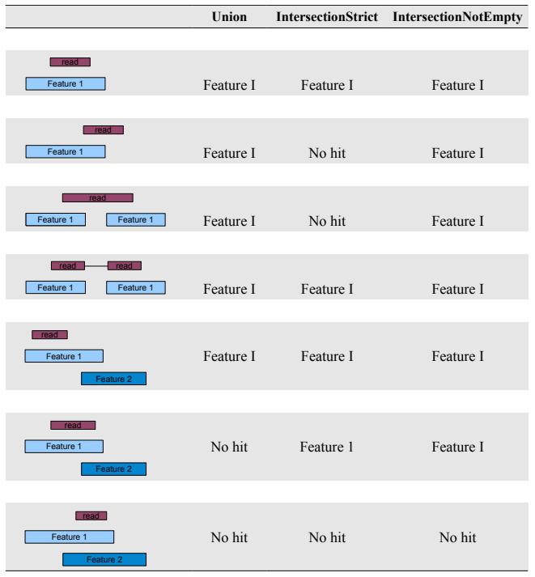

```{r setup, include=FALSE}
knitr::opts_chunk$set(echo = TRUE)
```

# Introduction
This vignette illustrates how reads mapped to a genome can be counted with `summarizeOverlaps()`. Different 'modes' of counting are provided to resolve reads that overlap multiple features. The built-in count modes are fashioned after the "Union", "IntersectionStrict", and "IntersectionNotEmpty" methods found in the `HTSeq` package.  

# A first example
In this example reads are counted from a list of BAM files and returned in a matrix for use in further analysis.  

```{r}
library(GenomicAlignments)
library(DESeq2)
library(edgeR)

fls <- list.files(system.file("extdata", package = "GenomicAlignments"), 
                  recursive = TRUE, pattern = "*bam$", full.names = TRUE)

features <- GRanges(
    seqnames = c(rep("chr22L", 4), rep("chr2R", 5), rep("chr3L", 2)), 
    ranges = IRanges(start = c(1000, 3000, 4000, 7000, 2000, 3000, 3600, 4000, 7500, 5000, 5400), 
                     width = c(rep(500, 3), 600, 900, 500, 300, 900, 300, 500, 500)), 
                     strand = "-", 
                     group_id = c(rep("A", 4), rep("B", 5), rep("C", 2)))

olap <- summarizeOverlaps(features = features, reads = fls)
deseq <- DESeqDataSet(se = olap, design = ~ 1)
edger <- DGEList(assay(olap), group = rownames(colData(olap)))
```

By default, the `summarizeOverlaps` function iterates through files in 'chunks' and with files processed in parallel. For finer-grain control over memory consumption, use the `BamFileList` function and specify the `yieldSize` argument (e.g., `yieldSize = 1000000`) to determine the size of each 'chunk' (smaller chunks consume less memory, but are a little less efficient to process). For controlling the number of processor in use, use `BiocParalell::register` to use an appropriate back-end, e.g., in Linux or Mac to process on 6 cores of a single machine use `register(MulticoreParam(workers = 6))`; see the `BiocParallel` vignette for further details.  

# Counting Modes
The modes of `Union`, `IntersectionStrict` and `IntersectionNotEmpty` provide different approaches to resolving reads that overlap multiple features. Figure below illustrates how both simple and gapped reads are handled by the modes.  

Note that a read is counted a maximum of once; there is no double counting.  

```{r counting modes}

```


# Counting Features
Features can be exons, transcripts, genes or any region of interest. The number of ranges that define a single feature is specified in the `features` argument.

When annotation regions of interest are defined by a single range a `GRanges` should be used as the `features` argument. With a `GRanges` it is assumed that each row (i.e., each range) represents a distinct feature. If `features` was a GRanges of exons, the result would be counts per exon.  

When the region of interest is defined by one or more ranges the `features` argument should
be a `GRangesList`. In practice this could be a list of exons by gene or transcripts by gene or
other similar relationships. The count result will be the same length as the `GRangesList`. For
a list of exons by genes, the result would be counts per gene.  

The combination of defining the features as either `GRanges` or `GRangesList` and choosing a counting mode controls how `summarizeOverlaps` assigns hits. Regardless of the mode chosen, each read is assigned to at most a single feature. These options are intended to provide flexibility in defining different biological problems.

```{r}
rd <- GAlignments(seqnames = Rle("chr1"), 
                  pos = as.integer(100), 
                  cigar = "300M", 
                  strand = strand("+"))

gr1 <- GRanges(seqnames = "chr1", ranges = IRanges(start = 50, width = 150), strand = "+")
gr2 <- GRanges(seqnames = "chr1", ranges = IRanges(start = 350, width = 150), strand = "+")
```

When provided as a `GRanges` both gr1 and gr2 are considered distinct features. In this case none of the modes count the read as a hit. Mode `Union` discards the read becasue more than 1 feature is overlapped. `IntersectionStrict` requires the read to fall completely within a feature which is not the case for either gr1 or gr2. `IntersetctionNotEmpty` requires the read to overlap a single unique disjoint region of the `features`. In this case gr1 and gr2 do not overlap so each range is considered a unique disjoint region. However, the read overlaps both gr1 and gr2 so a decision cannot be made and the read is discarded.

```{r}
# GRanges as features
# two features
gr <- c(gr1, gr2)

data.frame(union = assay(summarizeOverlaps(gr, rd)), 
           intStrict = assay(summarizeOverlaps(gr, rd, 
                                               mode = "IntersectionStrict")), 
           intNotEmpty = assay(summarizeOverlaps(gr, rd, 
                                                 mode = "IntersectionNotEmpty")))
```

```{r}
# GrangesList as features
# one features
grl <- GRangesList(c(gr1, gr2))

data.frame(union = assay(summarizeOverlaps(grl, rd, 
                                           mode = "Union")), 
           intStrict = assay(summarizeOverlaps(grl, rd, 
                                               mode = "IntersectionStrict")), 
           intNotEmpty = assay(summarizeOverlaps(grl, rd, 
                                                 mode = "IntersectionNotEmpty")))
```

```{r}
group_id <- c("A", "B", "C", "C", "D", "D", "E", "F", 'G', "G", "H", "H")
features <- GRanges(seqnames = Rle(c("chr1", "chr2", "chr1", "chr1", "chr2", "chr2", 
                                     "chr1", "chr1", "chr2", "chr2", "chr1", "chr1")), 
                    strand = strand(rep("+", lenghth = group_id)), 
                    ranges = IRanges(start = c(1000, 2000, 3000, 3600, 7000, 7500, 4000, 
                                               4000, 3000, 3350, 5000, 5400), 
                                     width = c(500, 900, 500, 300, 600, 300, 500, 
                                               900, 150, 200, 500, 500)), 
                    DataFrame(group_id))
names(features) <- letters[1:length(features)]
features

reads <- GAlignments(
    names = c("a", "b", "c", "d", "e", "f", "g"), 
    seqnames = Rle(c(rep(c("chr1", "chr2"), 3), "chr1")), 
    pos = as.integer(c(1400, 2700, 3400, 7100, 4000, 3100, 5200)), 
    cigar = c("500M", "100M", "300M", "500M", "300M", "50M200N50M", "50M150N50M"), 
    strand = strand(rep.int("+", 7L))
)
```

Using a `GRanges` as the `features` all 12 ranges are considered to be different features and counts are produced for each row.


```{r}
data.frame(
    union = assay(summarizeOverlaps(features, reads, mode = "Union")), 
    intStrict = assay(summarizeOverlaps(features, reads, mode = "IntersectionStrict")), 
    intNotEmpty = assay(summarizeOverlaps(features, reads, mode = "IntersectionNotEmpty"))
)
```

When the data are split by group to create a `GRangesList` the highest list-levels are treated as different features and the multiple list elements are considered part of the same features.  

```{r}
lst <- split(features, f = features$group_id)
lst %>% length()
```

```{r}
data.frame(
    union = assay(summarizeOverlaps(lst, reads, mode = "Union")), 
    intStrict = assay(summarizeOverlaps(lst, reads, mode = "IntersectionStrict")), 
    intNotEmpty = assay(summarizeOverlaps(lst, reads, mode = "IntersectionNotEmpty"))
)
```

If desired, users can supply their own counting function as the `mode` argument and take advantage of the infrastructure for counting over multiple BAM files and parsing the results into a `RangedSummarizedExperiment` object.


