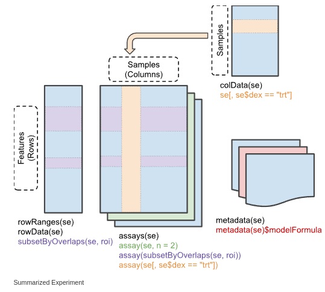

```{r setup, include=FALSE}
knitr::opts_chunk$set(echo = TRUE)
```

# Introduction  
The `SummarizedExperiment` class is used to store rectangular matrices of experimental results, which are commonly produced by sequencing and microarray experiments. Each object stores observations of one or more samples, along with additional meta-data describing both the observations (features) and samples (phenotypes).  

**A key aspect of the `SummarizedExperiment` class is the coordination of the meta-data and assays when subsetting**. For example, if you want to exclude a given sample you can do for both the meta-data and assay in one operation, which ensures the meta-data and observed data will remain in sync. Improperly accounting for meta and observational data has resulted in a number of incorrect results and retractions so this is a very desirable property.  

`SummarizedExperiment` is in many ways similar to the historical `ExpressionSet`, the main distinction being that  `SummarizedExperiment` is more flexible in it’s row information, allowing both `GRanges` based as well as those described by arbitrary `DataFrames`. This makes it ideally suited to a variety of experiments, particularly sequencing based experiments such as RNA-Seq and ChIp-Seq.  


# Anatomy of a `SummarizedExperiment`  
The `SummarizedExperiment` package contains two classes: `SummarizedExperiment` and `RangedSummarizedExperiment`.  

`SummarizedExperiment` is a matrix-like container where rows represent features of interest (e.g. genes, transcripts, exons, etc.) and columns represent samples. The objects contain one or more assays, each represented by a matrix-like object of numeric or other mode. The rows of a `SummarizedExperiment` object represent features of interest. Information about these features is stored in a  `DataFrame` object, accessible using the function `rowData()`. Each row of the `DataFrame`  provides information on the feature in the corresponding row of the `SummarizedExperiment` object. Columns of the `DataFrame` represent different attributes of the features of interest, e.g., gene or transcript IDs, etc.  

`RangedSummarizedExperiment` is the child of the `SummarizedExperiment` class which means that all the methods on `SummarizedExperiment` also work on a `RangedSummarizedExperiment`.  

The fundamental difference between the two classes is that the rows of a `RangedSummarizedExperiment` object represent genomic ranges of interest instead of a `DataFrame` of features. The `RangedSummarizedExperiment` ranges are described by a `GRanges` or a `GRangesList` object, accessible using the `rowRanges()` function.  

The following graphic displays the class geometry and highlights the vertical (column) and horizontal (row) relationships.  

```{r the relationship of row and column in SummarizedExperiment class}

```


## Assays
The `airway` package contains an example dataset from an RNA-Seq experiment of read counts per gene for airway smooth muscles. These data are stored in a `RangedSummarizedExperiment` object which contains 8 different experimental and assays 64,102 gene transcripts.

```{r}
BiocManager::install("airway")
library(airway)
data(airway)
se <- airway
se
```

To retrieve the experiment data from a `SummarizedExperiment` object one can use the `assays()` accessor. An object can have multiple assay datasets each of which can be accessed using the `$` operator. The airway dataset contains only one assay (`counts`). Here each row represents a gene transcript and each column one of the samples.

```{r}
library(magrittr)
assays(se)$counts %>% dim
```


## Row (regions-of-interest) data
The `rowRanges()` accessor is used to view the range information for a `RangedSummarizedExperiment`. (Note if this were the parent `SummarizedExperiment` class we'd use `rowData()`). The data are stored in a `GRangesList` object ,where each list element corresponds to one gene and the ranges in each `GRanges` correspond to the exons in the transcript. 

```{r}
se %>% rowRanges()
```

## Column (sample) data
Sample meta-data describing the sample can be accessed using `colData()`, and is a `DataFrame` that can store any number of descriptive columns for each sample row.

```{r}
se %>% colData()
```

This sample metadata can be accessed using the `$` accessor which makes it easy to subset the entire object by a given phenotype.

```{r}
se[, se$dex == "trt"]
```

## Experiment-wide metadata
Meta-data describing the experiment methods and publication references can be accessed using `metadata()`.  

```{r}
se %>% metadata
```

Note that `metadata()` is just a simple list, so it is appropriate for any experiment wide metadata the user wishes to save, such as storing model formulas.

```{r}
metadata(se)$formula <- counts ~ dex + albut
se %>% metadata()
```


# Constructing a `SummarizedExperiment`
Often, `SummarizedExperiment` or `RangedSummarizedExperiment` objects are returned by functions written by other packages. However it is possible to create them by hand with a call to the `SummarizedExperiment()` constructor.

```{r}
nrows <- 200
ncols <- 6
counts <- matrix(runif(nrows * ncols, 1, 1e4), nrows)
rowRanges <- GRanges(seqnames = rep(c("chr1", "chr2"), c(50, 150)), 
                     ranges = IRanges(start = floor(runif(200, 1e5, 1e6)), width = 100), 
                     strand = sample(c("+", "-"), 200, TRUE), 
                     feature_id = sprintf("ID%03d", 1:200))

colData <- DataFrame(Treatment = rep(c("ChIP", "Input"), 3), 
                     row.names = LETTERS[1:6])

ses <- SummarizedExperiment(assays = list(counts = counts), 
                            rowRanges = rowRanges, 
                            colData = colData)
ses
ses %>% colData
ses %>% rowData
```

A `SummarizedExperiment` can be constructed with or without supplying a `DataFrame` for the `rowData` argument.  


# Common operations on `SummarizedExperiment`
## subsetting
1. `[` Performs two dimensional subsettings, just like subsetting a matrix or data frame.  

```{r}
ses[1:5, 1:3]
```


2. `$` operates on `colData()` columns, for easy sample extraction.

```{r}
ses[, ses$Treatment == "ChIP"]
```

## getters and setters
1. `rowRanges()` or `rowData()`    
2. `colData()`  
3. `metadata()`  

```{r}
counts <- matrix(1:15, 5, 3, dimnames = list(LETTERS[1:5], LETTERS[1:3]))
dates <- SummarizedExperiment(assays = list(counts = counts), 
                              rowData = DataFrame(month = month.name[1:5], 
                                                  day = 1:5))

dates[rowData(dates)$month == "January", ]
```

4. `assay()` and `assays()`.  
There two accessor functions for extracting the assay data from a `SummarizedExperiment` object. `assays()` operates on the entire list of assay data as a whole, while `assay()` operates on only one assay at a time. `assay(x, i)` is simply a convenience function which is equivalent to `assays(x)[[i]]`. 

```{r}
assays(ses)
```

```{r}
assays(ses)[[1]][1:5, 1:5]
```

## Range-based operations
1. `subsetByOverlaps()`  
`SummarizedExperiment` objects support all of the `findOverlaps()` methods and associated functions. This includes `subsetByOverlaps()`, which makes it easy to subset a `SummarizedExperiment` object by an interval.

```{r}
roi <- GRanges(seqnames = 'chr1', ranges = IRanges(start = 100000, end = 1100000), strand = "+")
rowRanges(ses)
subsetByOverlaps(ses, roi)
```


