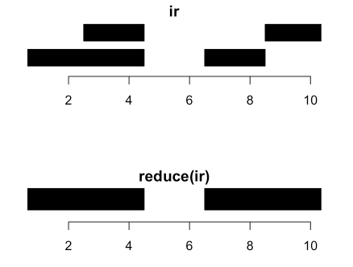
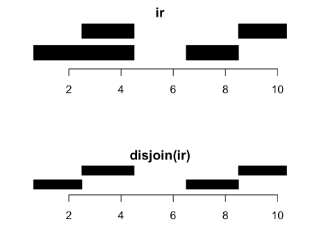

```{r setup, include=FALSE}
knitr::opts_chunk$set(echo = TRUE)
```


```{r load package, message=FALSE}
library(IRanges)
library(magrittr)
```

`IRanges` are collections of integer intervals. `GRanges` are like `IRanges`, but with an associated chromosome and strand, taking care of some book keeping.  


## Basic IRanges  
```{r}
?IRanges
irl <- IRanges(start = c(1, 3, 5), end = c(3, 5, 7))
```

```{r}
ir2 <- IRanges(start = c(1, 3, 5), width = 3)
```

```{r}
all.equal(irl, ir2)
```

An `IRanges` consist of separate intervals; each interval is called a range. So `irl` above contains 3 ranges.   

**Assessor methods: `start()`, `end()`, `width()` and also replacement methods**.  

```{r}
start(irl)
```

```{r}
width(irl)
```

```{r}
width(irl) <- 1
irl
```

```{r give they are names}
names(irl) <- paste("A", 1:3, sep = "") # row names 
irl
```

```{r IRange object only have one dimension}
dim(irl); length(irl)
```

```{r subsetting like vector}
irl[1]
```

```{r}
irl["A1"]
```

```{r concatenate two IRanges with c() function}
c(irl, ir2)
```


## Normal IRanges  
A normal IRanges is a minimal representation of the IRanges viewed as a set. Each integer only occur in a single range and there are as few ranges as possible. In addition, it is ordered.  

Many functions produce a normal `IRanges`. Created by `reduce()`.  
```{r}
ir <- IRanges(start = c(1, 3, 7, 9), width = c(4, 2, 2, 2))
```

```{r}
reduce(ir)
```




## Disjoin   
From some perspective, `disjoin()` is the opposite of `reduce()`.  
```{r}
ir
disjoin(ir)
```




## Manipulating IRanges, intra-range  
"Intra-range" manipulations are manipulations where each original range gets mapped to a new range.  

Examples of these are: `shift()`, `narrow()`, `flank()`, `resize()`, `restrict()`.  

`resize()` can be extremely useful. it has a *fix* argument controlling where the resizing occurs from. Use **fix = "center"** to resize around the center of the ranges.  

```{r}
resize(ir, width = 1, fix = 'start')
```

```{r}
resize(ir, width = 1, fix = "center")
```

More help can be found at `?"intra-range-methods"`  


## Manipulating IRanges as sets  
Manipulating `IRanges` as sets means that we view each `IRanges` as a set of integers; individual integers is either contained in one or more ranges or they are not. This is equivalent to calling `reduce()` on the `IRanges` first.  

Once this is done, we can use standard: `union()`, `intersect()`, `setdiff()`, `gaps()` between two `IRanges` (which all returns normalized `IRanges`).  

```{r union}
ir1 <- IRanges(start = c(1, 3, 5), width = 1)
ir2 <- IRanges(start = c(4, 5, 6), width = 1)
ir1;ir2;union(ir1, ir2)
```

```{r intersect}
intersect(ir1, ir2)
```

Because they return normalized `IRanges`, an alternative to `union()` is  
```{r}
reduce(c(ir1, ir2))
```

There are also an element-wise (pair-wise) version of these: `punion()`, `pintersect()`, `pgap()`; this is similar to say `pmax` from base R.  


## Finding Overlaps  
Finding (pair-wise) overlaps between two `IRanges` is done by `findOverlaps()`. This function is very important and amazingly fast!  
```{r}
ir1 <- IRanges(start = c(1, 4, 8), end = c(3, 7, 10))
ir2 <- IRanges(start = c(3, 4), width = 3)

ov <- findOverlaps(query = ir1, subject = ir2)
ov
```

It returns a `Hits` object which describes the relationship between the two `IRanges`. This object is basically a two-column matrix of indicies into the two `IRanges`.  

The two columns of the hits object can be accessed by `queryHits()` and `subjectHits`(often used with `unique()`).  

```{r}
queryHits(ov) %>% unique()
```


```{r}
intersect(x = ir1[queryHits(ov)], y = ir2[subjectHits(ov)]) %>% unique()
```


```{r}
args(findOverlaps)
```

you can ask to only get an overlap if two ranges overlap by a certain number of bases.  


## countOverlaps  
`countOverlaps()` which just returns the number of overlaps.  
```{r}
countOverlaps(query = ir1, subject = ir2) # query overlaped with subject
```


## Finding nearest IRanges  
Sometimes you have two sets of `IRanges` and you need to known which ones are closest to each other.  

Functions for this include `nearest()`, `preced()`, `follow()`.  

```{r}
ir1
```

```{r}
ir2
```

```{r}
nearest(x = ir1, subject = ir2)
```

## Summary 
- IRange object just like a vector  

- IRange object elements can be accessed and replaced like vector  

- IRange object elements can be manipulated like set  


## from vignette  
Two central classes are available in Bioconductor for representing ranges: the IRanges class
defined in the IRanges package for representing ranges defined on a single space, and the
GRanges class defined in the GenomicRanges package for representing ranges defined on
multiple spaces.  


```{r}
library(IRanges)
library(magrittr)
```


```{r}
ir1 <- IRanges(start = 1:10, width = 10:1)
ir2 <- IRanges(start = 1:10, end = 11)
ir3 <- IRanges(end = 11, width = 10:1)

identical(ir1, ir2) && identical(ir1, ir3)
```

```{r}
ir <- IRanges(start = c(1, 8, 14, 15, 19, 34, 40),
              width = c(12, 6, 6, 15, 6, 2, 7))
```

```{r}
start(ir);end(ir);width(ir)
```

```{r}
ir[1:4]
```

```{r}
ir[start(ir) <= 15]
```


```{r create a function to plot ranges}
plotRanges <- function(x, xlim = x, main = deparse(substitute(x)), col = "black", sep = 0.5, ...){
    height <- 1
    if(is(xlim, "IntegerRanges"))
        xlim <- c(min(start(xlim)), max(end(xlim)))
    bins <- disjointBins(IRanges(start(x), end(x) + 1))
    plot.new()
    plot.window(xlim, c(0, max(bins)*(height + sep)))
    ybottom <- bins * (sep + height) - height
    rect(start(x)-0.5, ybottom, end(x) + 0.5, ybottom + height, col = col, ...)
    title(main)
    axis(1)
}
```

```{r}
par(mar = c(6, 0, 6, 0))
plotRanges(ir)
```

it is occasionally useful to think of an IRanges object as a set of integers, where no elements are repeated and order does not matter.  


## IRangesList  
The IRangesList class asserts that each element is an IRanges object and provides convenience
methods, such as `start`, `end` and `width` accessors that return IntegerList objects, aligning
with the IRangesList object.  

```{r}
?IRangesList
rl <- IRangesList(ir, rev(ir))
start(rl)
```

```{r}
lambda <- c(rep(0.001, 4500), seq(0.001, 10, length.out = 500), seq(10, 0.001, length.out = 500))

xVector <- rpois(1e7, lambda)
yVector <- rpois(1e7, lambda)

xRle <- Rle(xVector)
yRle <- Rle(yVector)

irextract <- IRanges(start = c(4501:4901), width = 100)
xRle[irextract]
```


##Finding Overlapping Ranges  
```{r}
ol <- findOverlaps(ir, reduce(ir))
```


## counting overlapping reanges  
```{r}
cov <- coverage(ir)
plotRanges(ir)
cov <- as.vector(cov)
mat <- cbind(seq_along(cov) - 0.5, cov)
d <- diff(cov) != 0
mat <- rbind(cbind(mat[d, 1] + 1, mat[d, 2]), mat)
mat <- mat[order(mat[, 1]), ]
lines(mat, col = "red", lwd = 2)
axis(2)
```


## Finding Neighboring Ranges  
The `nearest` function finds the nearest neighbor ranges (overlapping is zero distance). The `precede` and `follow` functions find the non-overlapping nearest neighbors on a specific side.  


##Transforming Ranges  
```{r adjusting start, end and widths}
ir; shift(ir, 10)
```

```{r ranges can only be narrowed}
ir; narrow(ir, start = 1:5, width = 2)
```

```{r restrict ensures every range falls within a set of bounds}
ir; restrict(ir, start = 2, end = 10) #cut ranges in that region
```

The `threeband` function extends `narrow` so that the remaining left and right regions adjacent to the narrowed region are also returned in separate IRanges objects.  

```{r}
threebands(ir, start = 1:5, width= 2)
```


**The arithmetic operators +, - and * change both the start and the end/width by symmetrically expanding or contracting each range**.  

Adding or subtracting a numeric (integer) vector to an IRanges causes each range to be expanded or contracted on each side by the corresponding value in the numeric vector.  

```{r}
ir ;ir + seq_len(length(ir))
```


The `*` operator symmetrically magnifies an IRanges object by a factor, where positive contracts (zooms in) and negative expands (zooms out).  

```{r}
ir; ir * -2 # double the width
```

```{r}
ir; ir * 2 # narrows the width 
```


